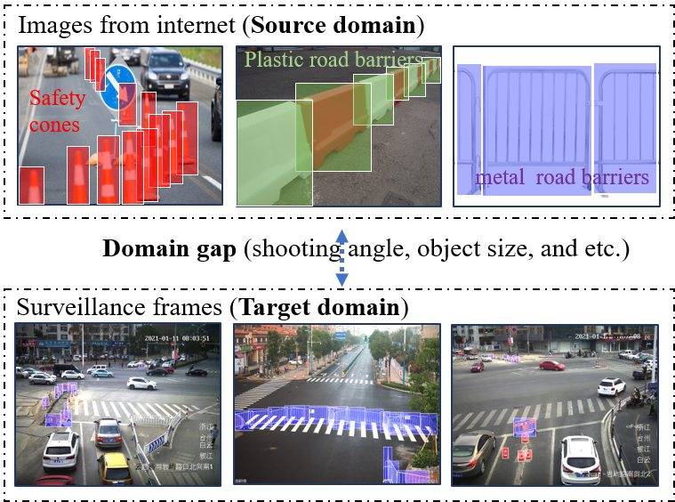
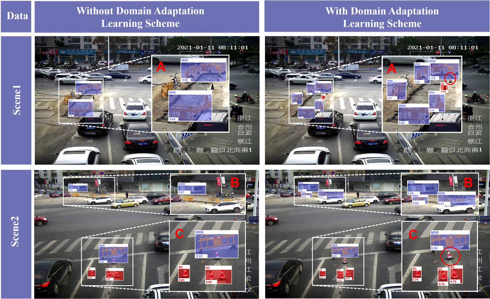

# Traffic-Equipment-Detection
## 1. Description 

To facilitate the research of traffic equipment detection from surveillance videos,  we build a  benchmark dataset for  traffic equipment detection in the real-world urban surveillance scenario. The featured properties of this dataset include:

- The images are shot from the roadside surveillance cameras located on urban roads (Jiangsu and Zhejiang province, China).
- It includes two sub-dataset, one is Internet image dataset and another is surveillance frame dataset . The Internet image dataset contains 90 images and 285 instances , while the surveillance frame dataset contains 80 images and 684 instances in the nighttime. 
- The image resolution in the surveillance frame dataset varies from 1920 × 1080 to 4096 × 2160. Some labeled images are shown the figure below. 
- The dataset will be continuously updated by collecting more surveillance videos containing traffic equipment from local traffic management department.

## 2. Download

To encourage related research, we will provide the dataset according to your request. Please email your full name and affiliation to the contact person (vvgod at seu dot edu dot cn). We ask for your information only to make sure the dataset is used for non-commercial purposes. We will not give it to any third party or publish it publicly anywhere. 

Different from other datasets, this dataset involves a lot of privacy such as license plate, human face, location information, etc. Therefore, before open source, we have to laboriously erase these private information. Thank you for your kind understanding!

## 3. Citation

Our  paper 《**An Automated Learning Framework with Limited and Cross-domain Data for Traffic Equipment Detection from Surveillance Videos**》is submitted to Journal ***《IEEE TRANSACTIONS ON INTELLIGENT TRANSPORTATION SYSTEMS》***,  When accepted, welcome to kindly cite it.

The below figure demonstrates some results of traffic equipment detection by our proposed few-shot framework, Notably, the first column presents the results generated by the framework trained without DALS, while the second column presents that with DALS. For clarify, the detected regions were enlarged and numbered as Region A, B, and C. Besides, the safety cone and metal road barrier were abbreviated as SC and MRB, respectively.

